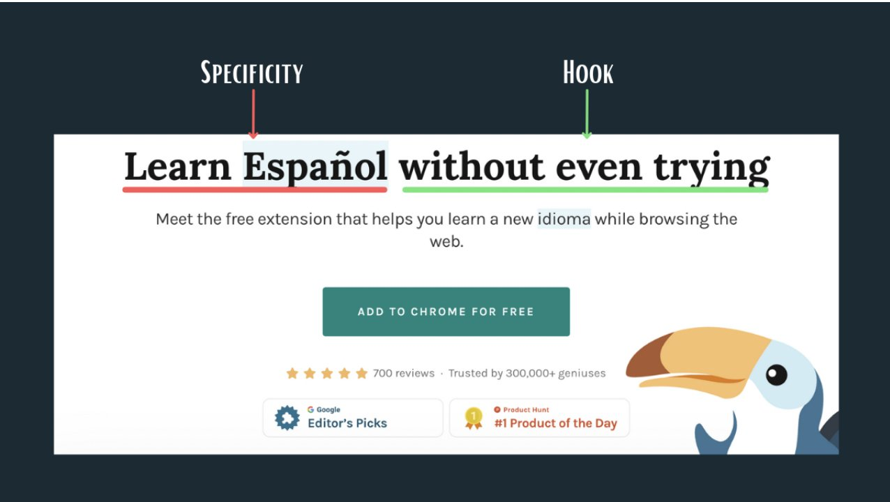

# How to write engaging one-liner / headline?

||Formula|Example
|--------|--------|--------|
|1| Specificity (Big Idea) x Hook (Your Magic Sauce)|
|2| Pain Point x Desire = Ask Question|
|3| Value x Objection|
|4| Value x What it is|