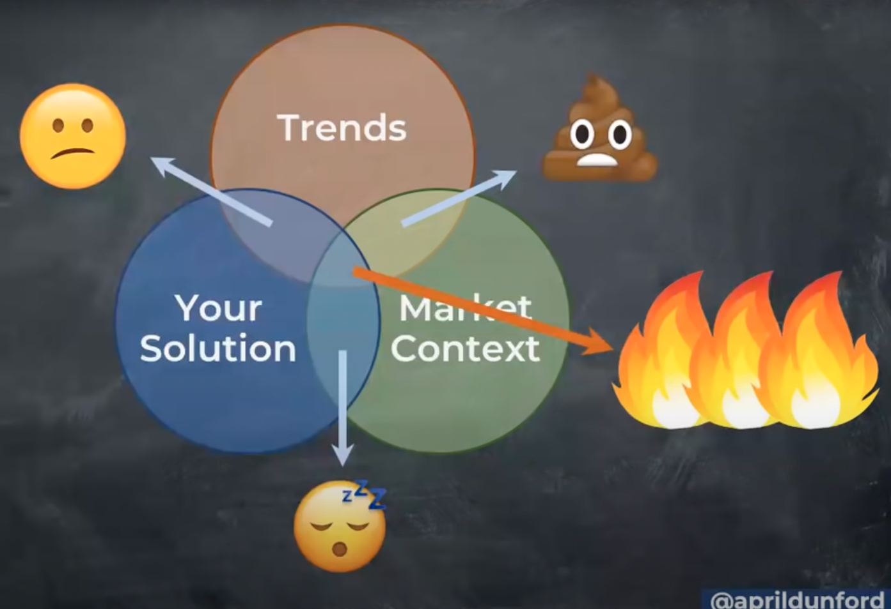
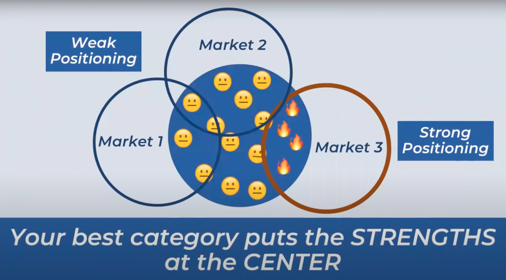

# How to nail your product positioning with April Dunford?

## 1. Introduction

> **Customers will use what they know to make sense of what they don't.** 

| Market categories | Trends | 
| :---:             | :---:  |
| - What is this?   | - Why now? |
| - Why should I care? | |

### 1.1. Market categories

When we declare that our product exists in a certain market category, it triggers a bunch of really powerful assumptions that helps tell customers `what it is?`. Common assumptions include:

- Who are your competitors? 
- What is your price point?
- What are the features of your product?
- Who is your target customer? 

### 1.2. Trends

It is easy to confuse "trends" with "markets".

- Trends are applied to market categories. 
- Trends cannot redefine a market but they can make it more interesting. 

### 1.3. Combinations

## 2. How should you choose the best position for your product?

1. Your positioning should advantage your unique strengths and differentiators.
2. Choose markets that overlay those strengths. 

> **Your best market category puts the strengths at the center.**

## Resources

https://www.youtube.com/watch?v=0dGps9fKO4Q